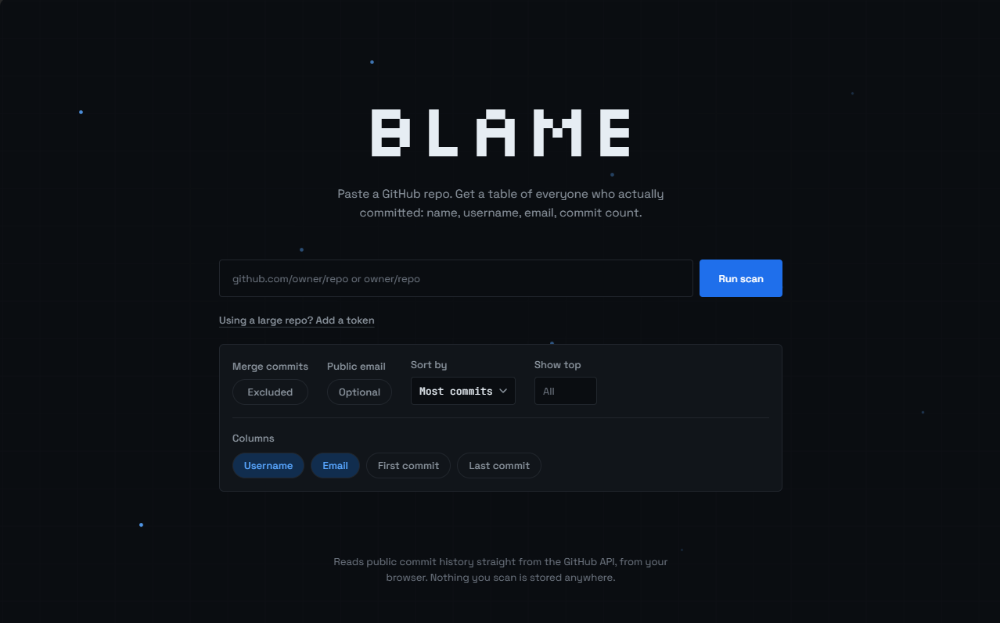

# blame

Answers one question for a GitHub repository: "who actually contributed, and how much?" Comes in two forms: a local CLI and a web app, both under the same name, `blame`. This project is mainly built to extract the mail id of contributors for recruitment/business purpose, but can be used for any purpose.



| | [`local/`](local) | [`web/`](web) |
|---|---|---|
| Form | Python CLI | Next.js single-page app |
| Data source | Clones the repo and reads `git log` directly | Calls the GitHub REST API from your browser |
| Coverage | Full history, every branch (`--all`) | Commits reachable from the default branch |
| Output | Terminal table, CSV, or JSON file | On-page table, copy as markdown/CSV, or an embeddable contributor-card image |
| Best for | Scripting, CI, full-repo audits, working offline once cloned | Quick one-off lookups, sharing a link, no install |

Both report the same core fields: name, email, GitHub username (when derivable), and commit count per contributor.

## `local/` — the CLI

Clones the target repo to a temp directory, runs `git log`, and aggregates commits by author email.

### Install

```powershell
cd local
python -m venv .venv
.\.venv\Scripts\Activate.ps1
python -m pip install -e .
```

### Use

```powershell
blame owner/repo
blame https://github.com/owner/repo
blame github.com/owner/repo
blame owner/repo --merges           # include merge commits (excluded by default)
blame owner/repo --sort-by name     # commits (default) / name / recent
blame owner/repo --limit 10         # top 10 contributors
blame owner/repo --has-email        # only contributors with a real, public email
blame owner/repo -o contributors.csv
blame owner/repo -o contributors.json
```

Requires `git` on your `PATH`. Notes:

- GitHub usernames are only filled in when the commit email is a `*@users.noreply.github.com` address — git itself has no concept of a GitHub username, so anything beyond that would require per-commit GitHub API calls.
- Contributors are grouped purely by email address. The same person committing under two different emails shows up as two rows — there's no account-linking concept at the git level to merge them.

## `web/` — the app

A single page: paste a repo, configure the scan, watch it run, get a table. Reads data straight from `api.github.com` in your browser — nothing is sent to or stored on a server.

### Run it locally

```powershell
cd web
npm install
npm run dev
```

Open [http://localhost:3000](http://localhost:3000).

### Use

1. Paste a repo as `owner/repo` or a full `github.com/owner/repo` URL.
2. Optionally expand **Add a token** and paste a GitHub personal access token, then click **Apply** — this raises the rate limit to 5,000 requests/hour and is required for private repos. The token is sent directly to `api.github.com` from your browser, never to this app's server. By default it's cleared on reload; toggle **Remember token** to keep it in this browser's local storage instead (opt-in — still only ever sent to `api.github.com`).

   If you don't supply a token, the scan first tries a same-origin proxy (`/api/github`) before falling back to a direct, unauthenticated call. If the deployment has a `GITHUB_TOKEN` configured (see "Embed a contributor card" below), that proxy transparently raises everyone's unauthenticated scans to the 5,000/hour budget — shared across all visitors of that deployment, not per-person. Paste your own token if you want a budget that's yours alone.
3. Adjust the scan options: require a public email, exclude bots, **embed image** (off by default), sort order, limit to the top N contributors, and which columns to show. Merge commits are always excluded — they don't represent original authorship, so there's no option to include them here (the CLI's `--merges` flag still exists for that case, see below).
4. Click **Run scan** and watch the progress log (resolving repo → fetching commits → aggregating authors → done).
5. The table shows a `#` rank column and up to 25 contributors per page, with Prev/Next navigation below it for longer lists — ranks reflect overall position, not position within the current page.
6. From the results table: **Copy as markdown** or **Download CSV** (these cover the full list, not just the current page). If you turned on **Embed image** before scanning, a copy-embed-snippet button and a live preview of the card also appear — the preview shows a small pulsing-dot loading state while the image renders, since generation can take a few seconds (see below).

### Embed a contributor card

Turning on **Embed image** before running a scan reveals a copy-snippet button and shows the actual card inline in the results, so you can see it before using it. The copied snippet looks like:

```md
[](https://gitblame.vercel.app)
```

Paste that into any README and it renders a contributor card generated live from `/api/card/[owner]/[repo]` — bots excluded automatically. Clicking the image always links back to the blame site itself, not the scanned repo (an embed doubles as attribution). The layout is dynamic:

- The top 5 contributors by commit count render as a small table (avatar, name, commit count).
- Up to 45 more render as avatar-only, in a grid capped at 9 per row — so the image gets wider (up to 9 avatars' worth) or taller (up to 5 rows) depending on how many contributors there actually are. A repo with 5 or fewer contributors shows just the table, no grid.
- The `blame` wordmark (in the real pixel font) sits bottom-right.

This is the one part of the app that runs server-side: a Next.js route handler that fetches from the GitHub API and renders a PNG with `next/og`. Responses are cached for 24 hours (`revalidate = 86400`, plus a matching `Cache-Control` header so browsers/CDNs/GitHub's own Camo image proxy skip re-requesting too) so a popular embed doesn't hammer GitHub's API on every pageview.

This endpoint necessarily uses one fixed, server-configured token (or none) — never a viewer's personal token. An embedded `` is loaded anonymously by anyone who opens the README, often via GitHub's Camo proxy rather than the original visitor's browser at all, so there's no per-viewer identity to attach a token to, and no way for an `` tag to carry an Authorization header even if there were. If you want an embed's rate limit backed by your own token, deploy your own instance and set `GITHUB_TOKEN` there (below) — that's what it's for.

If you're deploying this yourself and expect the card to see real traffic, set a `GITHUB_TOKEN` environment variable on the server — without it, every visitor loading the card shares your deployment's single 60-requests/hour unauthenticated budget across *all* embedded repos, which a handful of popular READMEs could exhaust. With a token it jumps to 5,000/hour. Use a **fine-grained personal access token scoped to "Public Repositories (read-only)"** — that access mode structurally cannot reach private repos or write anything, regardless of what else is selected, so it's the safest option even if the token were somehow exposed. (A classic PAT with zero scopes checked also works, just without that structural guarantee.) The token lives only in your server's environment; it's never exposed to the client or logged by this app.

### Server-side token fallback

The same `GITHUB_TOKEN` also backs a small proxy route, `/api/github`, used only when an interactive scan has no visitor-supplied token. The client tries this proxy first; it falls back to a direct, unauthenticated `api.github.com` call if the deployment has no `GITHUB_TOKEN` set, or if the proxy is unreachable. When a visitor *does* paste their own token, none of this applies — that path is unchanged and stays fully client-side, straight to `api.github.com`.

Two tradeoffs worth knowing before relying on this:

- **Shared budget.** Every visitor's unauthenticated scan on that deployment draws from the *same* 5,000-requests/hour pool. A few large concurrent scans can exhaust it for everyone else, whereas a visitor-supplied token is theirs alone.
- **Abuse surface.** `/api/github` only validates that `owner`/`repo` look like plausible GitHub identifiers and `resource` is one of a fixed allow-list (`repo`, `commits`) — it doesn't rate-limit callers itself. Anyone who finds the route can use it to read *any* public repo's commit history through your token's budget, not just repos scanned through this app's UI. If that's a concern for your deployment, put real rate-limiting in front of it (e.g. at a CDN/edge layer) or don't set `GITHUB_TOKEN` at all and let visitors supply their own tokens instead.

### Deploy

Standard Next.js app — deploys to Vercel (or any Next.js host) with zero required configuration. It has two server-side routes — `/api/card` for the embed feature above, and `/api/github`, a restricted proxy that lets the interactive scan fall back to the server's `GITHUB_TOKEN` — the interactive scan flow otherwise stays fully client-side.

```powershell
cd web
npx vercel deploy
```

### Notes

- Because it uses the GitHub API's commits endpoint rather than `git log --all`, it only sees history reachable from the repo's default branch — contributor counts can differ slightly from the CLI's full-history view.
- Contributors are grouped by GitHub account when a commit is linked to one, falling back to email otherwise. This means the **same person can still appear as two rows** if some of their commits were made before they linked their GitHub account (or with an email GitHub can't match) and others after — GitHub's API, not this tool, decides that linkage. Worth a manual sanity-check before treating a "top contributor" ranking as authoritative, especially for recruitment/outreach use.
- Bot detection is layered: (1) GitHub's own `Bot` account type — verified directly against live data to be fully reliable for any account registered as a GitHub App, including AI agents like `copilot-swe-agent[bot]`; (2) an exact-match list of known automated identities (email, display name, and username) that GitHub itself classifies as ordinary `User` accounts despite being pure automation — confirmed live via GitHub's own `/users/actions-user` endpoint, which returns `"type": "User"`, not `"Bot"`; (3) a username pattern for `bot` as a distinct token (`[bot]`, `-bot`, `bot-`, etc.). Layers 2–3 are inherently a maintained list, not a complete solution — there is no GitHub API field that distinguishes a script committing under a normal-looking account from a human, so this will always need extending as new cases turn up. See `looksLikeAutomatedAccount` in `web/src/lib/github.ts`.
- `PRODUCT.md` and `DESIGN.md` at the repo root document the product intent and visual design system behind the web app, for anyone extending it.
